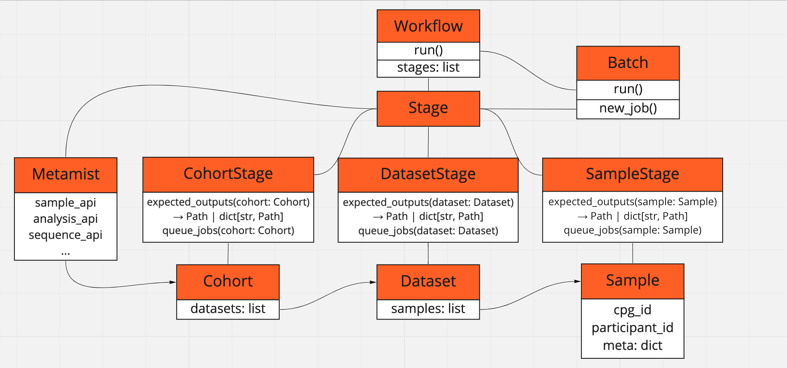

# Hail Batch Workflows

## Motivation

[Hail Batch](https://hail.is/#hail-batch) is a powerful system for workflow programming and execution using cloud compute and storage. In CPG, we manage our own Hail Batch deployment, along with the [analysis-runner](https://github.com/populationgenomics/analysis-runner) tool that provides an approachable and secure way to submit analysis scripts to Hail Batch.

In Hail, the workflows can be described using Python, and be built to be parts of more complex applications. E.g. the analysis-runner uses Hail Batch to drive itself, and the genomic variation analysis tool called Hail Query can use Hail Batch as a backend. All that makes Hail Batch a natural choice to design genomics workflows.

Classical genomics best-practices workflow implementations like [WARP](https://github.com/broadinstitute/warp) and [GATK-SV](https://github.com/broadinstitute/gatk-sv) use WDL to be run with [Cromwell](https://github.com/broadinstitute/cromwell) or Terra. In order to integrate WDL workflows into a Hail Batch infrastructure, there are a few possible approaches.

1. Start a Cromwell instance as part of Hail Batch job script, and submit a sub-workflow inside that job,
2. Maintain a managed Cromwell instance, and wrap only workflow submissions in a Hail Batch job,
3. Fully re-engineer WDL workflows in Python and Hail Batch.

For the GATK-SV workflow, we went with the approach #2. The workflow is quite complex, it uses many layers of branching nested sub-workflows, and it implements even minor file processing commands as separate WDL tasks. We also do not intend to adjust this workflow much as of now. In order to run GATK-SV, we support a managed Cromwell instance along with a [Python helper](https://github.com/populationgenomics/analysis-runner/blob/main/analysis_runner/cromwell.py#L230) that wraps interaction with Cromwell using Hail Batch jobs, and we utilize Cromwell API along with [Swagger](https://cromwell.populationgenomics.org.au/swagger/index.html?url=/swagger/cromwell.yaml#/Workflows/metadata) to explore Cromwell logs.

As for the WGS/WES germline variant workflows, we re-engineered them fully in Hail Batch, largely inspired by WARP, but with significant divergence from WARP: we added dataset-specific pedigree checks and dataset-specific MultiQC reports, allele-specific VQSR for WGS, cohort annotation using Hail Query and exporting to the Elasticsearch using scripts from [seqr-loading-pipelines](https://github.com/broadinstitute/seqr-loading-pipelines). There are also several CPG-specific layers, like reading inputs and metadata from [Metamist](https://github.com/populationgenomics/sample-metadata); reporting analysis results back to Metamist; setting global configuration with TOML; and a necessity for a more fine-grained tuning of tool's parameters and compute resources.

To facilitate re-engineering WARP workflows and creating workflows scratch, we implemented some abstractions in this module, namely a workflow "stage" with expected inputs, outputs, and dependencies, and "stage" target ("sample", "dataset", "cohort"). Unlike WDL's concept of nested sub-workflows, Hail Batch is intrinsically lower-level, naturally providing one layer of jobs, with each job corresponding to on bash script that is run on one cloud VM. That doesn't always match a higher-level task in the application domain. For example, a workflow stage called "genotype" can include multiple jobs to generate calling intervals, partition inputs, run the genotyping tool in parallel instances, gather results, perform post-processing and filtering. That "stage" would sit between an "alignment" stage and a "joint calling" stage, and a user might need to start a workflow from a specific stage, reusing pre-existing outputs; or run the pipeline only up to a specific stage. So it's helpful to abstract a set of jobs related in a domain-specific way as a stage, with an ability to restart/skip/select stages. It also turns out that GATK-SV facilitates from these abstractions too, as it consists of multiple disconnected sub-workflows of different levels.

## Stages



This library provides an abstraction interface on top of Hail Batch jobs, namely a `Stage` abstract class, parametrised by the `Target` abstract class, representing what target this stage works with. 

For example, a stage that performs read alignment to produce a CRAM file, would be derived from `SampleStage`, and be parametrised by `Sample`, and a stage that performs joint-calling would be derived from `CohortStage`, parametrised by `Cohort`.

Each `Stage` final implementation must declare paths to the outputs it would write in the `expected_outputs()` method. It must also define how jobs are added into Hail Batch using the `queue_jobs()` method.

For example, out "Align" stage that runs BWA might look like as following:

```python
from cpg_utils import Path
from cpg_utils.workflows.workflow import stage, SampleStage, Sample, StageInput, StageOutput

@stage
class Align(SampleStage):
    def expected_outputs(self, sample: Sample) -> Path:
        return sample.make_cram_path().path

    def queue_jobs(self, sample: Sample, inputs: StageInput) -> StageOutput | None:
        j = self.b.new_job('BWA', self.get_job_attrs(sample))
        j.command(f'bwa ... > {j.output}')
        self.b.write_output(j.output, str(self.expected_outputs(sample)))
        # Construct StageOutput object, where we pass a path to the results, 
        return self.make_outputs(sample, self.expected_outputs(sample), [j])
```

The `queue_jobs()` method is expected to return an output of type `StageOutput`: you can call `self.make_outputs()` to construct that object.

Stages can depend on each other (i.e. they form a directed acyclic graph), which is specified using a parameter `required_stages` to the `@stage` class decorator, and the `inputs` parameter in `queue_jobs()` to get the output of a previous stage. E.g. our sample genotyping stage might look like this:

```python
from cpg_utils import Path
from cpg_utils.workflows.workflow import stage, SampleStage, Sample, StageInput, StageOutput

Align = ...

@stage(required_stages=Align)
class Genotype(SampleStage):
    def expected_outputs(self, sample: Sample) -> Path:
        return sample.make_gvcf_path().path

    def queue_jobs(self, sample: Sample, inputs: StageInput) -> StageOutput | None:
        jobs = ...
        return self.make_outputs(sample, self.expected_outputs(sample), jobs)
```

Stage of different levels can depend on each other, and the library will resolve that correctly. E.g. joint calling stage that takes GVCF outputs to produce a cohort-level VCF would look like this:

```python
from cpg_utils import Path
from cpg_utils.workflows.workflow import stage, CohortStage, Cohort, StageInput, StageOutput

Genotype = ...

@stage(required_stages=Genotype)
class JointCalling(CohortStage):
    def expected_outputs(self, cohort: Cohort) -> Path:
        return cohort.analysis_dataset.prefix() / 'joint-called.vcf.gz'

    def queue_jobs(self, cohort: Cohort, inputs: StageInput) -> StageOutput | None:
        # Get outputs from previous stage. Because the Genotype stage
        # acts on a sample, we use a method `as_path_by_target` that returns
        # a dictionary index by sample ID:
        gvcf_path_by_sample = inputs.as_path_by_target(Genotype)
        assert len(gvcf_path_by_sample) == len(cohort.get_samples())
        jobs = ...
        return self.make_outputs(cohort, self.expected_outputs(cohort), jobs)
```

To submit a set of defined stages to Hail Batch, just call the `run_workflow(stages)` method:

```python
from cpg_utils.workflows.workflow import run_workflow
JointCalling = ...
run_workflow().run(stages=[JointCalling])
```

It takes a list of stage classes as a single parameter, and it would resolve all implicit dependencies automatically.

## Configuration

The library implicitly reads configuration using the `cpg_utils.config.get_config()` from a TOML file specified in the `CPG_CONFIG_PATH` environment variables, which are passed via the analysis runner's `--config` flag. For example, you can prepare a TOML config file `config.toml` as follows:

```toml
[workflow]
sequencing_type = 'genome'
only_datasets = ['hgdp', 'thousand-genomes']
skip_samples = ['CPG202994', 'CPG203000']
skip_stages = ['Align']
check_inputs = true  # checks e.g. if fastq for align stage exist
check_intermediates = false  # explitic calls to can_reuse(path) will return False 
check_expected_outputs = true  # if expected_outputs() exist, skip stage
```

And execute the workflow script `main.py` with the analysis-runner as follows:

```bash
analysis-runner --dataset seqr --access-level test -o test-workflow \
--config configs/config.toml main.py
```

The script would be able to access config parameters with 

```python
from cpg_utils.config import get_config
assert get_config()['workflow']['sequencing_type'] == 'genome'
```

Note that the workflow implicitly reads inputs from Metamist, and requires `workflow/only_datasets` and `workflow/sequencing_type` to be defined to pull proper inputs. Also keep in mind that analysis-runner would implicitly set a set of config parameters suitable specifically for the CPG infrastructure, e.g. 

```toml
[workflow]
access_level = 'test'
dataset_gcp_project = 'seqr-308602'
dataset = 'seqr'

[hail]
billing_project = 'seqr'
```

If you are not using analysis-runner, you have to set those explicitly. Check `config-template.toml` for a list of possible config parameters. It also provides defaults for some required parameters which might work for CPG only, e.g.

```toml
[workflow]
image_registry_prefix = 'australia-southeast1-docker.pkg.dev/cpg-common/images'
reference_prefix = 'gs://cpg-reference'
web_url_template = 'https://{namespace}-web.populationgenomics.org.au/{dataset}'

[images]
gatk = 'gatk:4.2.6.1'
# ...

[references]
genome_build = 'GRCh38'
somalier_sites = 'somalier/v0/sites.hg38.vcf.gz'
# ...
```

## Batch helpers

The `cpg_utils.workflows.batchbatch` module provides a helper function `get_batch` to set up Hail Batch in the CPG context, assuming `hail/billing_project` and `hail/backend` are set in config.

```python
from cpg_utils.workflows.batch import get_batch
b = get_batch(name='My batch')
j = b.new_job('My job', ...)
...
```

The Batch instance derives from a class extended from standard Hail `Batch` class, and it records stats of added jobs and prints statistics before submission, highlighting labelled jobs, e.g.:

```sh
Will submit 186 jobs:
BWA: 3 for 3 samples
Somalier extract (CRAMs): 3 for 3 samples
HaplotypeCaller: 3 for 3 samples
ReblockGVCF: 3 for 3 samples
Somalier extract (GVCFs): 3 for 3 samples
Other jobs: 171
```

The Batch instance also constructs the job name if the names of a sample and a dataset are provided as attributes, e.g.:

```bash
>>> j = b.new_job('My job', dict(sample='CPG196535', dataset='fewgenomes'))
>>> print(j.name)
fewgenomes/CPG196535: My job
```

`cpg_utils.hail_batch` provides a helper `command` to set up a command that can be used to add monitoring of disk space, or authenticate with GCP:

```python
from cpg_utils.hail_batch import command
j = ...
j.command(command('sleep 600', monitor_space=True, setup_gcp=True))
```

This will wrap the command as follows:

```bash
set -o pipefail
set -ex
export GOOGLE_APPLICATION_CREDENTIALS=/gsa-key/key.json
gcloud -q auth activate-service-account --key-file=$GOOGLE_APPLICATION_CREDENTIALS

(while true; do df -h; du -sh $BATCH_TMPDIR; sleep 600; done) &

sleep 600

df -h; du -sh $BATCH_TMPDIR
```

## Reusing existing results

`workflow/check_expected_outputs = true` controls whether the paths returned by `expected_outputs()` of each job correspond to existing objects, and would skip stages with already existing outputs.

You can also call the method `cpg_utils.workflows.utils.can_reuse(path)` explicitly within the code called from `queue_jobs()`. 
`workflow/check_intermediates = true` controls whether `can_reuse()` checks the object(s), or always returns `False`.

`workflow/check_inputs = true` controls whether inputs to the first stage in the pipeline should be checked for existence, e.g. alignment inputs for an `Align` stage. `skip_samples_with_missing_input` controls the behaviour if those inputs are missing: where skip such samples, or stop the workflow.

You can also start the pipeline from a specific stage with `workflow/first_stages` (it would skip all previous stages, but still check immediately required inputs for the first stage). `workflow/last_stages` would stop the workflow after the stages specified. `workflow/only_stages` would execute only stages specified, ignoring dependencies.

You can also force the pipeline to skip certain samples with `workflow/skip_samples`, pick only certain samples with `workfpow/only_samples`, force re-processing of certain samples with `workflow/force_samples`. `workflow/skip_datasets` and `workflow/only_datasets` are available, and more fine-grained combination of `skip_samples` and `skip_stages`: 

```toml
[workflow.skip_samples_stages]
VerifyBamId = ['CPG13409']
```
